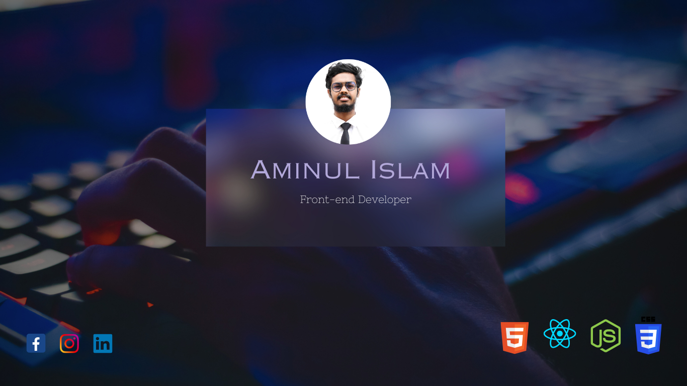

# Hi there!👋 I'm **Aminul Islam** ### a passionate web developer building my career in the world of web development.

## This is my main github account --> [Click Here](https://github.com/aminul157246)

## About Me
Greetings! I'm **Aminul Islam**, a passionate frontend developer dedicated to creating immersive digital experiences. With a foundation in **HTML**, **CSS**, **JavaScript**, **React**, **Node**, and **MongoDB**, I've evolved into a **Next.js** enthusiast, wielding its power to craft sleek and interactive user interfaces.

## Technologies & Tools
Proficient in HTML, CSS, JavaScript, React, Tailwind, MongoDB, and Node.js (basic). Building modern web applications with a focus on user-centric design and efficient backend integration.

### Tech Stack:

🔭 I’m currently working on... Building my career as a **Web Developer**.

🌱 I’m currently learning... TypeScript, Redux, Next.js, C++, Python

👯 I’m looking to collaborate on... projects involving HTML, CSS, and JavaScript, react, redux, next js, typescript. Eager to contribute to frontend design and development.

I'm eager to contribute to **frontend design and development**! If you have any exciting projects, feel free to reach out.

🤔 I’m looking for help with... Understanding advanced Next.js concepts, Redux, Typescript, Problem Solving and so on.

If you have expertise in these areas, I’d love to learn from you!

💬 Ask me about... Getting started with: HTML ,CSS, React.js,  Forntend Roadmap. I can assist with basic concepts, component creation, and state management and so on.

## 📫 How to reach me:
- Gmail: [aminul.islam.157246@gmail.com](mailto:aminul.islam.157246@gmail.com), Phone: +8801761743556
